# Cargo Regression

[](https://github.com/zao111222333/cargo-regression/actions/workflows/ci.yml)
[](https://crates.io/crates/cargo-regression)
[](https://opensource.org/licenses/MIT)

Collect test task from input files, execute them and compare results with golden.

## Usage

``` shell
cargo install cargo-regression
```

Build your test files like [./demo](./demo), then

``` shell
cargo regression ./demo --debug
```



The tests will be exectued in `./tmp` in default, change the directory by `--work-dir`. All arguments:

| Argument | Description |
| -- | -- |
| `--workdir xxx`| Change the directory to perform test |
| `--permits 2`| Set total permits to manage parallelism, see [`schedule-parallelism`](#schedule-parallelism) |
| `--debug`| Show debug information & config files |


### Set Extension(s)

`cargo-regression` will collect all files that match extensions as test tasks, you can set extensions in two ways:
+ By commmand arguments
``` shell
cargo regression ./demo --extensions py sh
```
+ By `xx/__all__.toml`
``` toml
# override for all sub-dir
extensions = ["py", "sh"]
```

### Other Config

Except `extensions` can only be define in `xx/__all__.toml`, the other configs can be define in both `xx/__all__.toml` and `xxx.toml`.
There are three types of configs:
+ `xx/__all__.toml`: Affect all task for current and all sub directories
+ `xxx.toml`: Only affect for input task file `xxx.xx`
+ Argument: Is equivalent to set it in the most top `/__all__.toml`

| Argument | In `xxx.toml` | Description |
| -- | -- | -- |
| `--exe-path bash` | `exe-path = "bash"` | The executable path to execute task |
| `--args {{name}}.sh arg1` | `args = ["{{name}}.sh", "arg1"]` | The arguements for execute task |
| NA | `envs = { k1 = "v1", k2 = "v2" }` | The environment variables, see [`test-match.toml`](demo/test-sh/test-match.toml) |
| NA | `extern-files = ["data.json"]` | In defualt only `{{name}}.xx` files will be linked to work dir, use this to link other files, see [`__all__.toml`](demo/test-py/__all__.toml) |
| `--print-errs` | `print-errs = true` | Print errors rather than save to reports |
| NA | `ignore = true` | Ignore that task |
| NA | `epsilon = 0.001` | The [`value`](#value) assert's tolerance, default is 1e-10 |

### Variable Table
There are a few keywords that will be replaced into its values, for all configs.
| Variable | Description |
| -- | -- |
| `{{root-dir}}`  | The absolute path of test root |
| `{{name}}`      | The name of task file |
| `{{extension}}` | The extension of task file |


### Extend Config

In default the configs will be override after you define them in `xxx.toml`. But for `args`, `envs`, and `extern-files`, you can extend them base on the super's configs. See [`test-extend.toml`](demo/test-sh/test-extend.toml)

## Advanced Features
### Test Filter
Only test specified tasks.
``` shell
# No filter
cargo regression ./demo
# Only include demo/trybuild/*
cargo regression ./demo --include demo/trybuild/*
# Exclude demo/trybuild/*
cargo regression ./demo --exclude demo/trybuild/*
# Combined filter
cargo regression ./demo --include demo/trybuild/* --exclude demo/trybuild/compile-ok.rs
```

### Schedule Parallelism
`permits` and `permit` are virtual resource costs, you can define `permits` in arguments (default=1), and define `permit` in task toml config file (default=0). See [`test-premit`](demo/test-premit)
``` shell
cargo regression ./demo --include demo/test-premit/* --permits 1
cargo regression ./demo --include demo/test-premit/* --permits 2
```


## assertion

### `exit-code`
Assert the exit code, default is `0`.
See [`test-exit.toml`](demo/test-py/test-exit.toml)
``` toml
[assert]
exit-code = 1
```

### `equal`
The output file should equal to the golden.
See [`compile-fail.toml`](demo/trybuild/compile-fail.toml)

``` toml
[[assert.golden]]
file = "{{name}}.stderr"
# The task's stder' should equal to __golden__/{{name}}.stderr
equal = true
```

### `match`

Match pattern and assert the number (count) of it.
See [`test-match.toml`](demo/test-sh/test-match.toml)

``` toml
[[assert.golden]]
# match pattern from task stdout
file = "{{name}}.stdout"
match = [
  # regular expression match
  { pattern = 'f.*o', count = 4 },
  # should contain word "fo" at least once
  { pattern = '\bfo\b', count-at-least = 1 },
  # should contain word "fo" at most once
  { pattern = '\bfo0\b', count-at-most = 1 },
]
```

### `value`

Capture float number and assert the value (count) of it.
The epsilon is assert tolerance, if the epsilon is not defined, default epsilon is 1e-10
See [`test-value.toml`](demo/test-sh/test-value.toml)

``` toml
[[assert.golden]]
# match float value from task stdout
file = "{{name}}.stdout"
value = [
  # match 'f.*o' and then match a float, assert it should within 4±0.01
  { pattern-before = 'f.*o', value = 4.0, epsilon = 0.01 },
  # match a float and then match 'after\b', assert it should > 1-0.0000000001
  { pattern-after = 'after\b', value-at-least = 1 },
  # math the float between 'f.*o' and 'after\b', assert it should within 4±0.0000000001
  { pattern-before = 'f.*o', pattern-after = 'after\b', value = 4.0 }
]
```

## Use its library

``` rust
use cargo_regression::{test, Args, TestExitCode};

#[tokio::main]
async fn main() -> TestExitCode {
  // Get arguments from CLI
  let args = Args::parse_from(std::env::args_os());
  // Or set fixed arguemnts
  let args = Args::new().debug(true).work_dir("tmp").root_dir("demo");
  args.test().await
}
```
See more in [`./examples`](./examples)

*Remind*: For fixed argument, the `include` and `exclude` variables should be all files matched by yourself,
use `["path/A", "path/B"]` rather than `["path/*"]`.

## TODO
+ regolden
+ full config document
+ document
